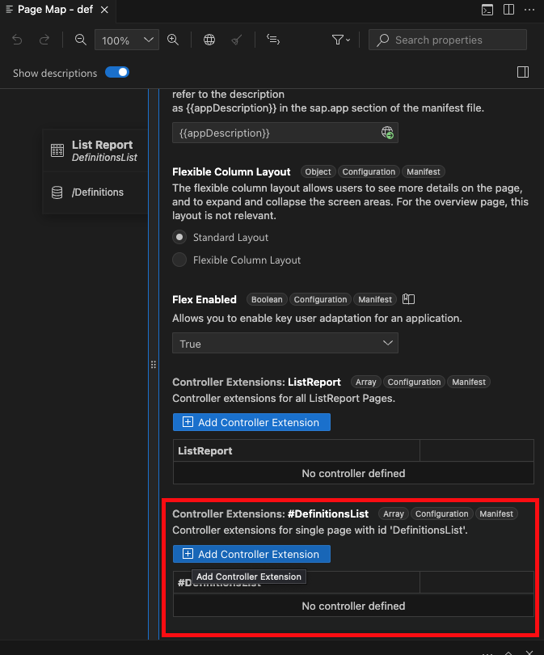
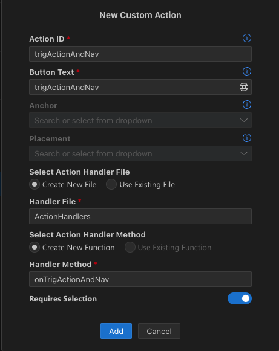
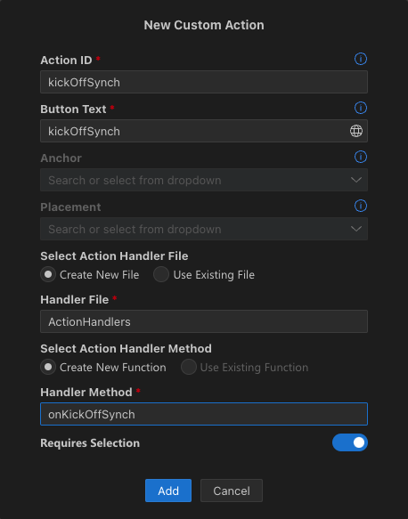

# Fiori Elements Problem 1
This repo reproduces a problem or problems in the SAP Fiori Elements Framework. 

My intent is to trigger an external navigation following a successful execution of a bound action. That external navigation should use the return (UUID) of the action as a parameter of the external navigation. 


## Reproduction of the problem
1. Clone the repo
2. Change to the `/sap-fe-bug-1` directory
3. Run `npm start`
4. Navigate to [http://localhost:4004/def/webapp/index.html](http://localhost:4004/def/webapp/index.html)

## Approach 1
The first idea is to use:
1. An annotation (and manifest.json) based approach to trigger the server side, bound action. This works well. 
2. Some sort of handler that
    1. receives the UUID for from the successful action and uses it to 
    2. trigger the external navigation with the received UUID as parameter


To that end I tried to create a Controller extensions for single page. 



To show the root problem to make progress, I assed the one line that shows oModel being undefined.... and I have not even added anything yet. 

```javascript
sap.ui.define(['sap/ui/core/mvc/ControllerExtension'], function (ControllerExtension) {
	'use strict';

	return ControllerExtension.extend('riz.synch.def.ext.controller.Appr1', {
		// this section allows to extend lifecycle hooks or hooks provided by Fiori elements
		override: {
			/**
             * Called when a controller is instantiated and its View controls (if available) are already created.
             * Can be used to modify the View before it is displayed, to bind event handlers and do other one-time initialization.
             * @memberOf riz.synch.def.ext.controller.Appr1
             */
			onInit: function () {
				// you can access the Fiori elements extensionAPI via this.base.getExtensionAPI
				var oModel = this.base.getExtensionAPI().getModel();

				// !!! ONLY ADDED this line to the original code !!!
				if (!oModel) {
					alert('Model not found')
				}

			}
		}
	});
});
```

To reproduce the first issue, you can open up the application url [http://localhost:4004/def/webapp/index.html](http://localhost:4004/def/webapp/index.html) and receive the error message that the Model was not found. 


## Approach 2
The second idea is similar to the first one:
1. An annotation (and manifest.json) based approach to trigger the server side, bound action. This works well. 
2. Some sort of handler that
    1. receives the UUID for from the successful action and uses it to 
    2. trigger the external navigation with the received UUID as parameter


To that end I tried to create a Controller extensions for **all ListReport Pages**. 

The implementation of the code is as before (only show the added lines in this example):

```javascript
	// !!! ONLY ADDED this line to the original code !!!
				if (!oModel) {
					alert('Model not found')
				}
```

To reproduce the first issue, you can open up the application url [http://localhost:4004/def/webapp/index.html](http://localhost:4004/def/webapp/index.html) and receive the error message that the Model was not found. 

The problem seems to be the same. `oModel` is undefined

## Approach 3
The third idea is to replace the whole thing with a custom action handler. 
I used the following parameters: 



The ActionHandlers.js file was defaulted with the starting point. All I did was add a console.log output. 
```javascript
sap.ui.define([
    "sap/m/MessageToast"
], function(MessageToast) {
    'use strict';

    return {
        onTrigActionAndNav: function(oEvent) {
            MessageToast.show("Custom handler invoked.");

            // !!! ONLY ADDED THE FOLLOWING LINE !!!
            console.log("Custom handler invoked.", oEvent);
        }
    };
});
```

When I check the Google Chrome console I receive `Custom handler invoked. undefined`


Without a proper bound event I don't seem to be able to use any of the examples I can find at present.


## Approach 4
In this approach we are using a custom action button with a bound action in CAP. 

1. Adding a 'custom action' rather than an 'action' prompts the following dialog


2. The custom action automatically generates the following code:
```javascript
sap.ui.define([
    "sap/m/MessageToast"
], function(MessageToast) {
    'use strict';

    return {
        onKickOffSynch: async function(oEvent) {
            MessageToast.show("Custom handler invoked.");
        }
    };
});
```
3. When i add a console log output to the function, I receive an 'undefined' oEvent


